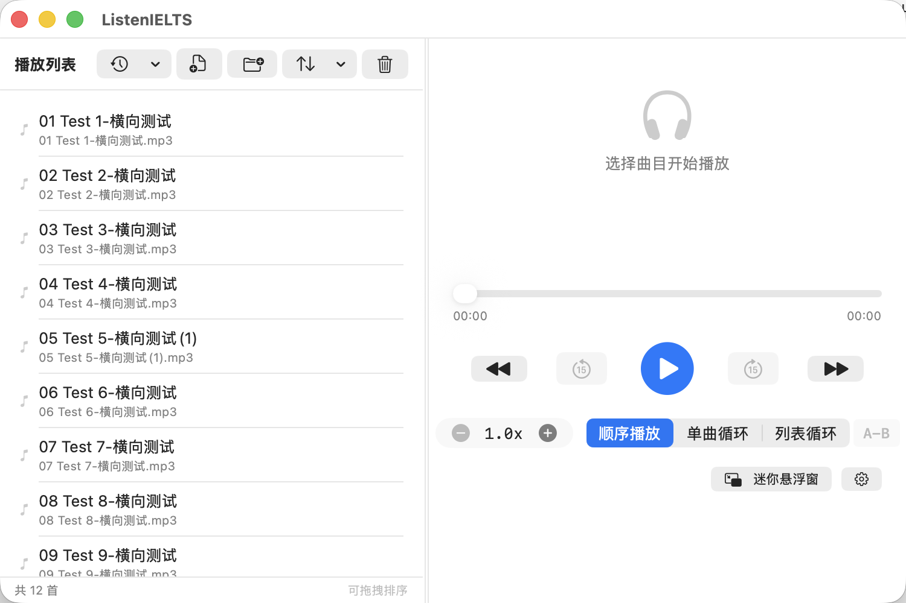
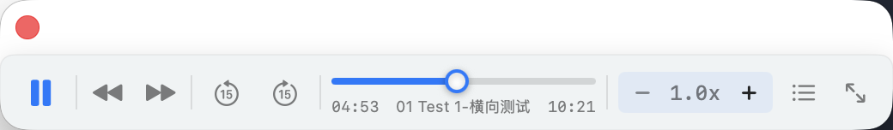

# 🎧 ListenIELTS

> 一款专为英语听力练习打造的 macOS 悬浮音频播放器。专注、轻量，让听力练习更高效。


## 📸 应用截图

### 主窗口



### 迷你悬浮窗



## ✨ 主要特性

### 🎵 专业的播放体验
- **AB 区间循环** — 精确标记 A、B 两点，反复播放任意区间，最适合精听单词、句子、词组
- **0.1x 步进调速** — 1.0x → 2.0x 之间任意调速，双击重置回 1.0x
- **15 秒快进/回退** — 听不清就回去再听一遍
- **三种播放模式** — 顺序播放 / 单曲循环 / 列表循环

### 🪟 智能悬浮窗
- 始终置顶，做其他事情时也能控制播放
- 默认显示在屏幕**右上角**，可拖拽到任意位置
- 进度条带拖拽小球，单手操作精准跳转
- 自带**播放列表面板**，无需返回主窗口即可切换曲目
  - 智能判断上下空间，自动选择展开方向，绝不遮挡迷你窗
  - 列表跟随迷你窗移动，拖动时同步定位
- 可选「在所有桌面（Space）显示」

### 📂 强大的播放列表管理
- 支持单文件添加、整个文件夹批量导入、拖拽添加
- **历史记录** — 自动记录最近打开的 20 个文件夹/文件，一键切换
- **排序方式** — 文件名 A→Z / Z→A、添加顺序、手动拖拽，每个文件夹独立记忆
- **启动恢复** — 可选项，下次启动自动加载上次的播放列表
- 支持手动拖拽调整顺序

### 🎨 简洁的交互设计
- 单击曲目即可播放（不用双击）
- 鼠标悬停即变蓝高亮，整行可点击
- 当前曲目无论是否在播放都保持蓝色文字，配合图标变化（🔊 / ⏸）一眼锁定位置
- 设计语言贴近 macOS 原生

### 🎼 支持的格式

`MP3` · `M4A` · `WAV` · `AAC` · `FLAC` · `AIFF` · `OGG` · `WMA`

---

## 🚀 安装与运行

### 方法一：直接打包为 .app（推荐）

```bash
git clone https://github.com/yourusername/ListenIELTS.git
cd ListenIELTS
chmod +x build.sh
./build.sh
open ListenIELTS.app
```

打包完成后会在项目根目录生成 `ListenIELTS.app`，把它拖到「应用程序」文件夹即可从 Launchpad 启动。

> ⚠️ 首次打开如果 macOS 提示「无法验证开发者」：
> 右键点击 `ListenIELTS.app` → 选择「打开」→ 再点一次「打开」即可。

### 方法二：命令行运行（开发模式）

```bash
cd ListenIELTS
swift run
```

### 方法三：一键更新到 /Applications

修改代码后想快速更新到系统已安装版本：

```bash
chmod +x update.sh
./update.sh
```

脚本会自动关闭运行中的旧版、编译新版本、覆盖 `/Applications/ListenIELTS.app`，并启动新版。

---

## 📖 使用指南

### 添加音频
- 点击工具栏「📄+」选择单个文件
- 点击「📁+」选择整个文件夹（递归扫描所有支持的音频格式）
- 直接把文件或文件夹拖到主窗口
- 点击「🕐」从历史记录里选择最近打开过的文件夹/文件

### AB 区间循环
1. 播放到要循环的开始位置，点击 `A-B` 按钮 → 标记 **A 点**
2. 播放到要循环的结束位置，再次点击按钮 → 标记 **B 点**，循环立即开始
3. 进度条上方会显示橙色 A 标记 + 蓝色 B 标记 + 半透明区间高亮
4. 第三次点击按钮 → 取消循环

非常适合反复听一句话、一个单词或一个词组直到完全听清。

### 迷你悬浮窗
- 主窗口点击「迷你悬浮窗」或按 `⌘⇧M` 进入悬浮模式
- 进度条上的白色小球可拖拽精准定位
- 点击 📋 图标弹出播放列表，点击曲目直接切换
- 拖动迷你窗时，播放列表会跟随移动
- 关闭悬浮窗（× 按钮）回到主窗口

### 排序与记忆
- 列表工具栏的 `⇅` 按钮选择排序方式
- 每个文件夹会**独立记住**最后用的排序方式
- 默认按文件名 A→Z 排序

---

## ⌨️ 快捷键速查

| 快捷键 | 功能 |
|--------|------|
| `Space` | 播放 / 暂停 |
| `←` | 回退 15 秒 |
| `→` | 快进 15 秒 |
| `⌘←` | 上一首 |
| `⌘→` | 下一首 |
| `⌘⇧M` | 切换迷你悬浮窗 |

---

## ⚙️ 设置项

通过主窗口右下角的齿轮图标进入：

- **在所有桌面显示悬浮窗** — 让迷你窗在每个 Space 都出现
- **启动时恢复上次播放列表** — 下次启动自动加载上次的列表

---

## 🏗 项目结构

```
ListenIELTS/
├── Package.swift                 # SPM 配置
├── build.sh                      # 一键打包为 .app
├── update.sh                     # 一键更新到 /Applications
├── generate_icon.py              # 应用图标生成器
└── Sources/
    ├── AppMain.swift             # 应用入口、菜单命令
    ├── AudioPlayerManager.swift  # 音频播放引擎（AVFoundation + AB 循环）
    ├── PlaylistManager.swift     # 播放列表、持久化、排序
    ├── HistoryManager.swift      # 历史记录管理
    ├── FloatingWindowManager.swift # 悬浮窗管理（NSWindow）
    ├── Models.swift              # 数据模型
    └── Views/
        ├── MainWindowView.swift  # 主窗口 UI
        └── MiniPlayerView.swift  # 迷你悬浮窗 UI + 播放列表面板
```

---

## 💻 系统要求

- **macOS 14.0 (Sonoma)** 或更高
- Apple Silicon 或 Intel Mac
- 编译需要 **Swift 6.0+**（macOS 自带 Xcode Command Line Tools 即可）

---

## 🛠 技术栈

- **SwiftUI 4** — 现代声明式 UI
- **AppKit** — NSWindow 实现真正的系统级悬浮窗
- **AVFoundation** — 音频播放引擎
- **Combine** — 响应式状态管理
- **Swift Package Manager** — 项目构建

---

## 📜 License

MIT License — 自由使用、修改、分发。

---

## 🙋 反馈与贡献

欢迎提 Issue 报告 bug 或建议新功能。如果你也用它练听力，欢迎在 Issues 里分享你的使用心得。
